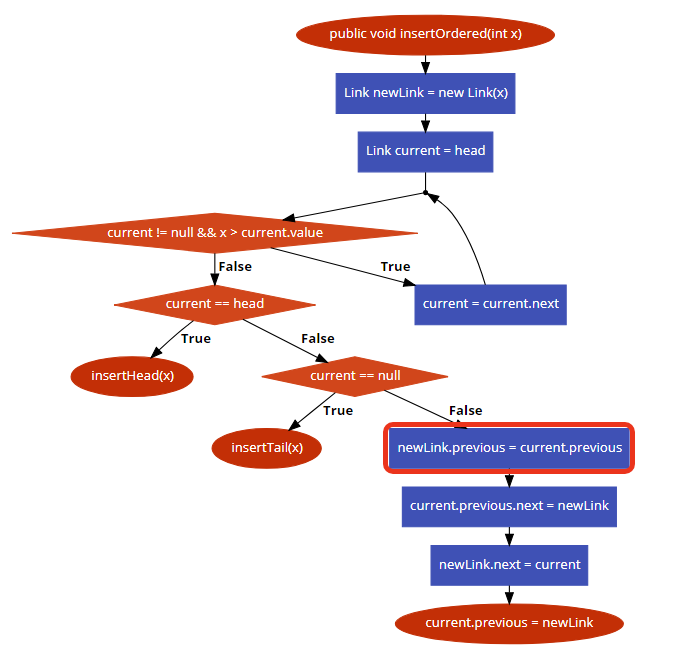

# Generation Unit Test for insertOrdered Function


### Họ và tên : Phạm Thị Linh
### Lớp : K61CACLC1;
### Mã sinh viên : 16020247
### _______________


### Source code: https://github.com/TheAlgorithms/Java/blob/master/DataStructures/Lists/DoublyLinkedList.java

```sh
1   public void insertOrdered(int x) {
2       Link newLink = new Link(x);
3       Link current = head;
4       while (current != null && x > current.value) // Find the position to insert
5           current = current.next;
6
7       if (current == head)
8           insertHead(x);
9       else if (current == null)
10            insertTail(x);
11
12        else { // Before: 1 <--> 2(current) <--> 3
13            newLink.previous = current.previous; // 1 <-- newLink
14            current.previous.next = newLink; // 1 <--> newLink
15            newLink.next = current; // 1 <--> newLink --> 2(current) <--> 3
16            current.previous = newLink; // 1 <--> newLink <--> 2(current) <--> 3}
17    }

```

### 1. Flowchart



### 2. List of Road

#### Path 1: 1 &rarr; 2 &rarr; 3 &rarr; 4 &rarr; 7 &rarr; 9 &rarr; 12 &rarr; 13 &rarr; 14 &rarr; 15 &rarr; 16 &rarr; 17
#### Path 2: 1 &rarr; 2 &rarr; 3 &rarr; 4 &rarr; 7 &rarr; 8 &rarr; 9 &rarr; 12 &rarr; 17  
#### Path 3: 1 &rarr; 2 &rarr; 3 &rarr; 4 &rarr; 7 &rarr; 9 &rarr;  10 &rarr; 12 &rarr; 17 
#### Path 4: 1 &rarr; 2 &rarr; 3 &rarr; 4 &rarr; 5 &rarr; 7 &rarr; 9 &rarr; 12 &rarr; 13 &rarr; 14 &rarr; 15 &rarr; 16 &rarr; 17 
#### Path 5: 1 &rarr; 2 &rarr; 3 &rarr; 4 &rarr; 5 &rarr;7 &rarr; 8 &rarr; 9 &rarr; 12 &rarr; 17 
#### Path 6: 1 &rarr; 2 &rarr; 3 &rarr; 4 &rarr; 5 &rarr;7 &rarr; 9 &rarr;  10 &rarr; 12 &rarr; 17 


### 3. Path Conditions

#### Path 1: current == null || x <= current.value && current!=head && current(afterLoop) != null
#### Path 2: current == null || x <= current.value && current==head 
#### Path 3: current == null || x <= current.value && current!=head && current(afterLoop) == null
#### Path 4: current != null && x > current.value && current!=head && current(afterLoop) != null
#### Path 5: current != null && x > current.value && current==head 
#### Path 6: current != null && x > current.value && current!=head && current(afterLoop) == null

### 4. Generate Test Case

#### Path 1: Infeasible(while no run so current = head, but current != head) 
#### Path 2: x = 1,List{}
#### Path 3: Infeasible(while no run so current = head, but current != head) 
#### Path 4: x = 1,List{2}
#### Path 5: Infeasible(while loop run so current != head, but current = head)
#### Path 6: x = 5,List{3,4}


### 5. Expected Output
	
#### Path 1: Infeasible
#### Path 2: List{1}
#### Path 3: Infeasible
#### Path 4: List{1,2}
#### Path 5: Infeasible
#### Path 6: List{3,4,5}